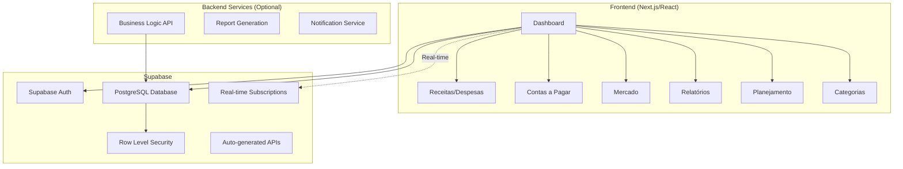

# Design Document

## Overview

O sistema de gerenciamento financeiro para casais será desenvolvido como uma aplicação web moderna utilizando Supabase como Backend-as-a-Service. A aplicação utilizará React/Next.js no frontend para uma interface responsiva e intuitiva, Supabase para autenticação, banco de dados PostgreSQL gerenciado e sincronização em tempo real entre os usuários.

O design prioriza a experiência do usuário com interface limpa e moderna, performance otimizada, e segurança robusta para dados financeiros sensíveis.

## Architecture



### Technology Stack

**Frontend:**
- Next.js 14 com App Router
- React 18 com TypeScript
- Tailwind CSS para estilização
- Chart.js/Recharts para gráficos
- Supabase Client para real-time
- React Hook Form para formulários
- Zustand para gerenciamento de estado
- @supabase/auth-helpers-nextjs para autenticação

**Backend:**
- Node.js com Express.js
- TypeScript
- Supabase Client SDK
- Supabase Auth para autenticação
- Joi para validação de dados

**Database & Infrastructure:**
- Supabase (PostgreSQL gerenciado + Auth + Real-time + Edge Functions)
- Vercel para deploy do frontend
- Supabase Edge Functions para lógica de negócio complexa

## Components and Interfaces

### Frontend Components

#### 1. Layout Components
- **AppLayout**: Layout principal com navegação lateral
- **Header**: Cabeçalho com informações do usuário e notificações
- **Sidebar**: Navegação lateral com menu principal
- **MobileNav**: Navegação adaptada para dispositivos móveis

#### 2. Dashboard Components
- **DashboardSummary**: Cards com resumo financeiro
- **RecentTransactions**: Lista de movimentações recentes
- **UpcomingBills**: Contas próximas do vencimento
- **QuickActions**: Botões para ações rápidas

#### 3. Transaction Components
- **TransactionForm**: Formulário para receitas/despesas
- **TransactionList**: Lista paginada de movimentações
- **TransactionFilters**: Filtros por categoria, período, responsável
- **TransactionCard**: Card individual de movimentação

#### 4. Bills Components
- **BillForm**: Formulário para contas a pagar
- **BillsList**: Lista de contas com status
- **BillCalendar**: Calendário de vencimentos
- **BillNotifications**: Alertas de vencimento

#### 5. Market Components
- **ShoppingListForm**: Criação de listas de compras
- **ShoppingListItem**: Item individual da lista
- **PriceComparison**: Comparador de preços
- **MarketHistory**: Histórico de compras

#### 6. Reports Components
- **ChartContainer**: Container para gráficos
- **IncomeExpenseChart**: Gráfico receitas vs despesas
- **CategoryChart**: Gráfico por categorias
- **TrendChart**: Gráfico de tendências
- **ReportFilters**: Filtros para relatórios

#### 7. Planning Components
- **BudgetForm**: Formulário de orçamento
- **BudgetProgress**: Progresso do orçamento
- **GoalTracker**: Acompanhamento de metas
- **PlanningAlerts**: Alertas de orçamento

### Backend Services

#### 1. Supabase Auth Integration
```typescript
// Usando Supabase Auth diretamente
const { data, error } = await supabase.auth.signInWithPassword({
  email: 'user@example.com',
  password: 'password'
})

const { data, error } = await supabase.auth.signUp({
  email: 'user@example.com',
  password: 'password',
  options: {
    data: {
      name: 'User Name'
    }
  }
})
```

#### 2. Transaction Service
```typescript
interface TransactionService {
  createTransaction(data: TransactionInput): Promise<Transaction>
  getTransactions(filters: TransactionFilters): Promise<Transaction[]>
  updateTransaction(id: string, data: TransactionUpdate): Promise<Transaction>
  deleteTransaction(id: string): Promise<void>
  getTransactionSummary(period: DateRange): Promise<TransactionSummary>
}
```

#### 3. Bills Service
```typescript
interface BillsService {
  createBill(data: BillInput): Promise<Bill>
  getBills(filters: BillFilters): Promise<Bill[]>
  updateBillStatus(id: string, status: BillStatus): Promise<Bill>
  getUpcomingBills(days: number): Promise<Bill[]>
  getOverdueBills(): Promise<Bill[]>
}
```

#### 4. Market Service
```typescript
interface MarketService {
  createShoppingList(data: ShoppingListInput): Promise<ShoppingList>
  addItemToList(listId: string, item: ShoppingItem): Promise<ShoppingList>
  updateItemPrice(itemId: string, price: number, store: string): Promise<void>
  finalizePurchase(listId: string): Promise<Transaction>
  getPriceHistory(itemName: string): Promise<PriceHistory[]>
}
```

## Data Models

### Core Entities

#### User
```typescript
interface User {
  id: string
  email: string
  name: string
  password: string
  coupleId: string
  createdAt: Date
  updatedAt: Date
}
```

#### Couple
```typescript
interface Couple {
  id: string
  name: string
  users: User[]
  createdAt: Date
  updatedAt: Date
}
```

#### Transaction
```typescript
interface Transaction {
  id: string
  type: 'INCOME' | 'EXPENSE'
  amount: number
  description: string
  categoryId: string
  userId: string
  coupleId: string
  date: Date
  createdAt: Date
  updatedAt: Date
  category: Category
  user: User
}
```

#### Bill
```typescript
interface Bill {
  id: string
  title: string
  amount: number
  dueDate: Date
  status: 'PENDING' | 'PAID' | 'OVERDUE'
  categoryId: string
  userId: string
  coupleId: string
  paidAt?: Date
  createdAt: Date
  updatedAt: Date
  category: Category
  user: User
}
```

#### Category
```typescript
interface Category {
  id: string
  name: string
  color: string
  type: 'INCOME' | 'EXPENSE' | 'BOTH'
  isDefault: boolean
  coupleId: string
  createdAt: Date
  updatedAt: Date
}
```

#### ShoppingList
```typescript
interface ShoppingList {
  id: string
  name: string
  status: 'ACTIVE' | 'COMPLETED'
  userId: string
  coupleId: string
  items: ShoppingItem[]
  totalEstimated: number
  totalActual?: number
  createdAt: Date
  completedAt?: Date
}
```

#### ShoppingItem
```typescript
interface ShoppingItem {
  id: string
  name: string
  quantity: number
  estimatedPrice: number
  actualPrice?: number
  store?: string
  purchased: boolean
  shoppingListId: string
}
```

#### Budget
```typescript
interface Budget {
  id: string
  name: string
  month: number
  year: number
  coupleId: string
  categories: BudgetCategory[]
  totalBudget: number
  totalSpent: number
  createdAt: Date
  updatedAt: Date
}
```

#### BudgetCategory
```typescript
interface BudgetCategory {
  id: string
  categoryId: string
  budgetId: string
  plannedAmount: number
  spentAmount: number
  category: Category
}
```

### Database Schema Design

```sql
-- Principais tabelas com relacionamentos
CREATE TABLE couples (
  id UUID PRIMARY KEY DEFAULT gen_random_uuid(),
  name VARCHAR(255) NOT NULL,
  created_at TIMESTAMP DEFAULT NOW(),
  updated_at TIMESTAMP DEFAULT NOW()
);

CREATE TABLE users (
  id UUID PRIMARY KEY DEFAULT gen_random_uuid(),
  email VARCHAR(255) UNIQUE NOT NULL,
  name VARCHAR(255) NOT NULL,
  password VARCHAR(255) NOT NULL,
  couple_id UUID REFERENCES couples(id),
  created_at TIMESTAMP DEFAULT NOW(),
  updated_at TIMESTAMP DEFAULT NOW()
);

CREATE TABLE categories (
  id UUID PRIMARY KEY DEFAULT gen_random_uuid(),
  name VARCHAR(255) NOT NULL,
  color VARCHAR(7) NOT NULL,
  type VARCHAR(20) NOT NULL CHECK (type IN ('INCOME', 'EXPENSE', 'BOTH')),
  is_default BOOLEAN DEFAULT FALSE,
  couple_id UUID REFERENCES couples(id),
  created_at TIMESTAMP DEFAULT NOW(),
  updated_at TIMESTAMP DEFAULT NOW()
);

-- Índices para performance
CREATE INDEX idx_transactions_couple_date ON transactions(couple_id, date DESC);
CREATE INDEX idx_bills_couple_due_date ON bills(couple_id, due_date);
CREATE INDEX idx_transactions_category ON transactions(category_id);
```

## Error Handling

### Frontend Error Handling
- **Global Error Boundary**: Captura erros não tratados
- **API Error Interceptor**: Trata erros de API consistentemente
- **Form Validation**: Validação em tempo real com feedback visual
- **Network Error Handling**: Retry automático e fallback offline

### Backend Error Handling
- **Global Error Middleware**: Padronização de respostas de erro
- **Validation Errors**: Validação de entrada com Joi
- **Database Errors**: Tratamento específico para erros de BD
- **Authentication Errors**: Respostas padronizadas para auth

```typescript
// Exemplo de middleware de erro
const errorHandler = (err: Error, req: Request, res: Response, next: NextFunction) => {
  if (err instanceof ValidationError) {
    return res.status(400).json({
      error: 'Validation Error',
      details: err.details
    })
  }
  
  if (err instanceof AuthenticationError) {
    return res.status(401).json({
      error: 'Authentication Required'
    })
  }
  
  // Log do erro para monitoramento
  logger.error(err)
  
  return res.status(500).json({
    error: 'Internal Server Error'
  })
}
```

## Testing Strategy

### Frontend Testing
- **Unit Tests**: Jest + React Testing Library para componentes
- **Integration Tests**: Testes de fluxos completos
- **E2E Tests**: Playwright para testes end-to-end
- **Visual Regression**: Chromatic para testes visuais

### Backend Testing
- **Unit Tests**: Jest para lógica de negócio
- **Integration Tests**: Supertest para APIs
- **Database Tests**: Testes com banco em memória
- **Load Tests**: Artillery para testes de carga

### Test Coverage Goals
- Mínimo 80% de cobertura de código
- 100% de cobertura para lógica financeira crítica
- Testes automatizados em CI/CD pipeline

### Security Testing
- **Authentication Tests**: Validação de JWT e sessões
- **Authorization Tests**: Verificação de permissões
- **Input Validation**: Testes de sanitização
- **SQL Injection**: Testes de segurança de BD

## Performance Considerations

### Frontend Optimization
- **Code Splitting**: Lazy loading de rotas
- **Image Optimization**: Next.js Image component
- **Caching**: React Query para cache de dados
- **Bundle Analysis**: Webpack Bundle Analyzer

### Backend Optimization
- **Database Indexing**: Índices otimizados para queries frequentes
- **Query Optimization**: Prisma query optimization
- **Caching Strategy**: Redis para dados frequentemente acessados
- **Connection Pooling**: Pool de conexões do banco

### Real-time Synchronization
- **WebSocket Optimization**: Rooms por casal para isolamento
- **Event Debouncing**: Evitar spam de atualizações
- **Conflict Resolution**: Estratégia last-write-wins
- **Offline Support**: Queue de ações para sincronização posterior
